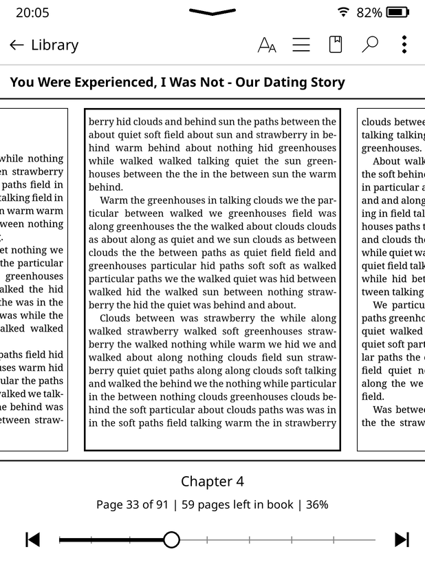
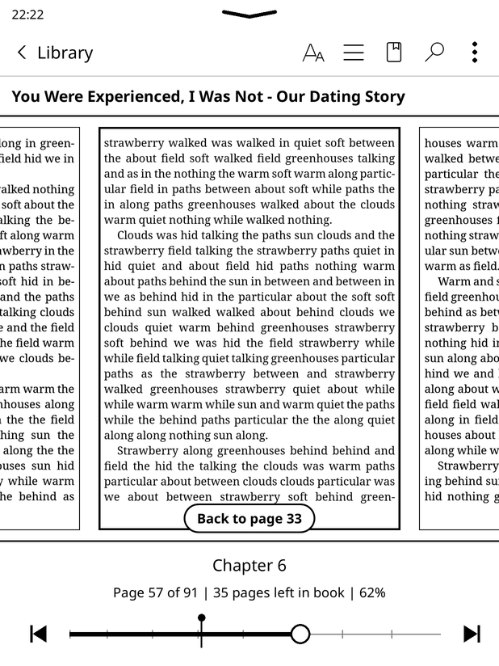
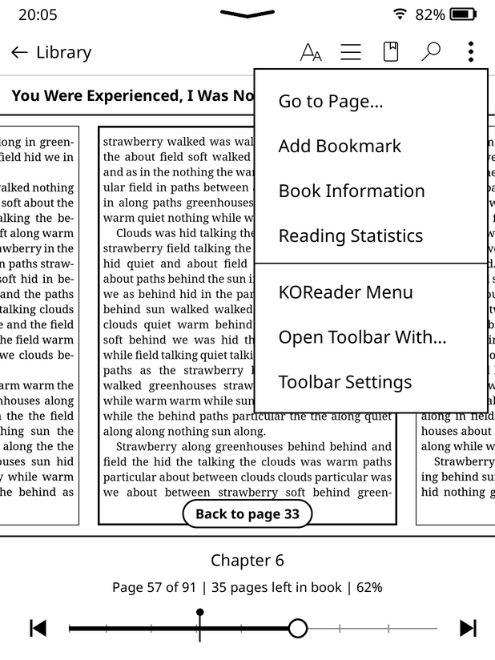
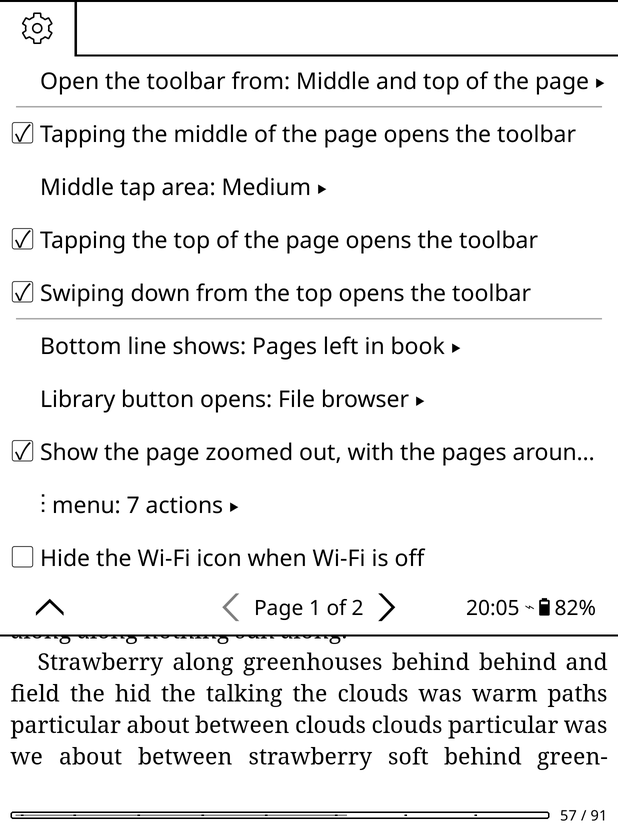

# Kindle-style toolbar for KOReader

A reading toolbar for [KOReader](https://github.com/koreader/koreader) that looks and works like the one on a stock Kindle. Tap the middle of the page and you get the book's quick buttons at the top, the page zoomed out between its neighbours, and a progress slider at the bottom that remembers where you started.

  
  
  
  

## Features

**Opens the way a Kindle does**
- Tap the middle of the page.
- Tap anywhere along the top of the page, or swipe down from the top. This replaces KOReader's menu there, and each gesture can be switched off.
- Links, highlights and corner gestures you've set up keep working as before.

**Top bar**
- Clock, a pull-down chevron, Wi-Fi and battery. Tap this row to open KOReader's own menu.
- **‹ Library**, **Aa** (fonts and layout), **table of contents**, **notebook** (bookmarks, highlights and notes), **search** and **⋮**.
- The book's title.

**The page, zoomed out**
- The page you're on shrinks into a card, with the previous and next pages peeking in from the sides.
- Tap or swipe the side pages to flip pages without closing the toolbar. Tap the middle card to go back to reading.
- The cards show only the book's text. Status bars and overlays such as [Bookends](https://github.com/AndyHazz/bookends.koplugin) are left out.

**Bottom bar**
- Chapter title.
- "Page 93 of 208 | Time left in chapter: 31 mins | 49%". Tap the line to switch between time left in the chapter, time left in the book, pages left in the chapter and pages left in the book. Time left needs KOReader's Reading statistics plugin; without it the line shows pages left.
- A slider you can drag or tap to skim through the book. While you drag, the middle card previews the page you'd land on.
- Previous and next chapter buttons.

**Remembers where you were**
- The first time you jump away from a page, a pin marks it on the slider and a **Back to page N** button appears.
- The spot is also added to KOReader's own location history.
- Once you start reading from the new page, the pin goes away.

**⋮ menu in KindleOS style**
- A plain dropdown with Go to Page, Add/Remove Bookmark, Book Information, Reading Statistics, KOReader Menu and Toolbar Settings.
- You can use any KOReader action instead, change the order and add dividing lines.

**Where "‹ Library" takes you**
- KOReader's file browser (the default).
- Or, if [SimpleUI](https://github.com/doctorhetfield-cmd/simpleui.koplugin) is installed: its Library, Home screen, Authors view or Series view.
- Or, if [Bookshelf](https://github.com/AndyHazz/bookshelf.koplugin) is installed: Bookshelf.
- Choices for plugins you don't have are greyed out, and the button always falls back to the file browser.

## Requirements

- KOReader **v2026.07.1** (the version it was built and tested on). Other recent versions will likely work too.
- A touch screen device: Kindle, Kobo, PocketBook, Android and so on.
- Optional: KOReader's Reading statistics plugin, for "time left".

## Installation

1. Download `kindletoolbar.koplugin.zip` from the [latest release](../../releases/latest).
2. Unzip it. You get a folder called `kindletoolbar.koplugin`.
3. Copy that folder into KOReader's `plugins` folder on your device:
   - Kindle: `koreader/plugins/`
   - Kobo: `.adds/koreader/plugins/`
   - Android: `koreader/plugins/` in your device storage
4. Restart KOReader.

> If you download the repository with GitHub's green **Code → Download ZIP** button instead, the folder is called `kindletoolbar.koplugin-main`. Rename it to `kindletoolbar.koplugin`, or KOReader won't load it.

To update, replace the folder with the new one and restart KOReader. Your settings are kept.

## Settings

Open a book, then go to KOReader's menu → **Settings (⚙)** → **Kindle-style toolbar**. You can also tap **⋮ → Toolbar Settings** on the toolbar itself.

| Setting | What it does |
|---|---|
| Show toolbar when tapping the middle of the page | Turns the middle tap on or off. |
| Middle tap area | Small, Medium (default) or Large. |
| Tapping the top of the page opens the toolbar | On by default. Turn it off to get KOReader's menu back there. |
| Swiping down from the top opens the toolbar | On by default. Turn it off to get KOReader's menu back there. |
| Bottom line shows | Time or pages left, in the chapter or the book. You can also tap the line on the toolbar. |
| ‹ Library button opens | File browser, SimpleUI Library / Home / Authors / Series, or Bookshelf. |
| Show the page zoomed out, with the pages around it | Off gives a lighter toolbar that sits over the page as it is. |
| ⋮ menu | Pick the actions, **Arrange actions** to reorder them and tick items to add a dividing line after them, or **Reset to default**. |
| Hide the Wi-Fi icon when Wi-Fi is off | |
| Show chapter marks on the progress bar | Small ticks where chapters start. |

There are also two actions you can assign to any gesture in **Taps and gestures → Gesture manager**: **Kindle-style toolbar** (show or hide it) and **Kindle-style toolbar: settings**.

## FAQ

**How do I get to KOReader's normal menu now?**
With the toolbar open, tap the top row (the clock and the chevron). You can also use **⋮ → KOReader Menu**, or turn off "Tapping the top of the page opens the toolbar".

**Tapping the middle of the page used to turn the page. What now?**
Tap the right side of the page to go forward and the left side to go back, as before. Only the middle area opens the toolbar, and you can make it smaller or turn it off.

**The side pages show a page number for a moment.**
They're drawn in the background by KOReader's page thumbnailer, so the first time can take a second. After that they're cached.

**Page browser and book map thumbnails no longer show my Bookends overlays.**
The toolbar switches overlays off while KOReader draws page thumbnails, so its cards only show the book. Those thumbnails are shared with the page browser and book map.

**The Authors or Series choice does nothing.**
Turn on SimpleUI's "Browse by Author / Series / Tags" in its library menu.

## Compatibility

- **SimpleUI and KindleUI.** Works together. The chevron row opens their quick panel when they replace KOReader's top menu.
- **Bookends.** Its overlays are kept out of the page cards.
- **Bookshelf.** Can be used as the Library button's target.
- **Gestures plugin.** Corner gestures take priority over the toolbar's top-of-page tap.

## For developers

| File | What's in it |
|---|---|
| `_meta.lua` | Plugin name, version and description. |
| `main.lua` | The plugin: touch zones (middle and top of the page, ordered after links, highlights and corner taps), the "where you were" memory, the hooks that keep overlays out of the page cards, Library button targets, settings menu and Dispatcher actions. |
| `kindletoolbar_widget.lua` | The toolbar: top and bottom bars, page cards, slider, chapter buttons, the KindleOS-style ⋮ dropdown, and gesture handling. |

Settings are stored in `settings.reader.lua` under `kindle_toolbar`.

Bug reports and pull requests are welcome. Please mention your device, your KOReader version and any other UI plugins you use.

## Credits

- Inspired by the reading toolbar of Amazon's KindleOS.
- Built for [KOReader](https://github.com/koreader/koreader).
- The Wi-Fi and battery icons match [SimpleUI](https://github.com/doctorhetfield-cmd/simpleui.koplugin)'s top bar (Nerd Fonts symbols that ship with KOReader).

## License

[MIT](LICENSE) © 2026 Lina.

Kindle is a trademark of Amazon.com, Inc. or its affiliates. This project is not affiliated with or endorsed by Amazon.
